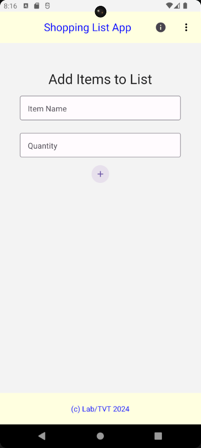
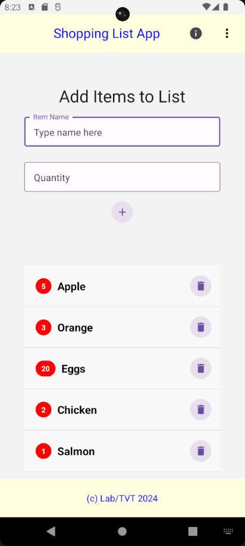

<<<<<<< HEAD
This is a new [**React Native**](https://reactnative.dev) project, bootstrapped using [`@react-native-community/cli`](https://github.com/react-native-community/cli).

# Getting Started

>**Note**: Make sure you have completed the [React Native - Environment Setup](https://reactnative.dev/docs/environment-setup) instructions till "Creating a new application" step, before proceeding.

## Step 1: Start the Metro Server

First, you will need to start **Metro**, the JavaScript _bundler_ that ships _with_ React Native.

To start Metro, run the following command from the _root_ of your React Native project:

```bash
# using npm
npm start

# OR using Yarn
yarn start
```

## Step 2: Start your Application

Let Metro Bundler run in its _own_ terminal. Open a _new_ terminal from the _root_ of your React Native project. Run the following command to start your _Android_ or _iOS_ app:

### For Android

```bash
# using npm
npm run android

# OR using Yarn
yarn android
```

### For iOS

```bash
# using npm
npm run ios

# OR using Yarn
yarn ios
```

If everything is set up _correctly_, you should see your new app running in your _Android Emulator_ or _iOS Simulator_ shortly provided you have set up your emulator/simulator correctly.

This is one way to run your app — you can also run it directly from within Android Studio and Xcode respectively.

## Step 3: Modifying your App

Now that you have successfully run the app, let's modify it.

1. Open `App.tsx` in your text editor of choice and edit some lines.
2. For **Android**: Press the <kbd>R</kbd> key twice or select **"Reload"** from the **Developer Menu** (<kbd>Ctrl</kbd> + <kbd>M</kbd> (on Window and Linux) or <kbd>Cmd ⌘</kbd> + <kbd>M</kbd> (on macOS)) to see your changes!

   For **iOS**: Hit <kbd>Cmd ⌘</kbd> + <kbd>R</kbd> in your iOS Simulator to reload the app and see your changes!

## Congratulations! :tada:

You've successfully run and modified your React Native App. :partying_face:

### Now what?

- If you want to add this new React Native code to an existing application, check out the [Integration guide](https://reactnative.dev/docs/integration-with-existing-apps).
- If you're curious to learn more about React Native, check out the [Introduction to React Native](https://reactnative.dev/docs/getting-started).

# Troubleshooting

If you can't get this to work, see the [Troubleshooting](https://reactnative.dev/docs/troubleshooting) page.

# Learn More

To learn more about React Native, take a look at the following resources:

- [React Native Website](https://reactnative.dev) - learn more about React Native.
- [Getting Started](https://reactnative.dev/docs/environment-setup) - an **overview** of React Native and how setup your environment.
- [Learn the Basics](https://reactnative.dev/docs/getting-started) - a **guided tour** of the React Native **basics**.
- [Blog](https://reactnative.dev/blog) - read the latest official React Native **Blog** posts.
- [`@facebook/react-native`](https://github.com/facebook/react-native) - the Open Source; GitHub **repository** for React Native.
=======
# ShoppingList

A cross-platform Shopping List app built with React Native, supporting both Android and iOS. Easily add, view, and manage your shopping items with a clean and intuitive interface.

## Features

- Add items to your shopping list
- Remove items from the list
- View all items in a scrollable list
- Simple, modern UI
- Fast and responsive
- Works on Android and iOS

## Screenshots

| Home Screen | List View |
|-------------|-----------|
|  | 

## Demo Video
*Watch it here:*
https://www.youtube.com/watch?v=ahE8RejpoTw

## Getting Started

### 1. Install Prerequisites
- [Node.js](https://nodejs.org/)
- [Yarn](https://yarnpkg.com/) or npm
- [React Native CLI](https://reactnative.dev/docs/environment-setup)
- Android Studio (for emulators and SDK)
- Java 17 (JDK)

### 2. Set Up Android Environment
- Open Android Studio and install the Android SDK and an emulator (AVD).
- Add the Android SDK and platform-tools to your system PATH:
  - Example: `C:\Users\<YourUser>\AppData\Local\Android\Sdk\platform-tools`
- Set the `ANDROID_HOME` environment variable to your SDK path.

### 3. Clone and Install Dependencies
```bash
# Clone the repository
$ git clone https://github.com/yourusername/ShoppingList.git
$ cd ShoppingList

# Install dependencies
$ yarn install
# or
$ npm install
```

### 4. Create a Debug Keystore (if needed)
If you get signing errors, create a debug keystore:
```cmd
keytool -genkeypair -keystore android\app\debug.keystore -storetype JKS -storepass android -alias androiddebugkey -keypass android -keyalg RSA -keysize 2048 -validity 10000
```

### 5. Start Metro Bundler
```bash
$ yarn start
# or
$ npm start
```

### 6. Run on Android Emulator
- Start your Android emulator from Android Studio.
- In a new terminal, run:
```bash
$ yarn android
# or
$ npm run android
```

### Troubleshooting
- If you see errors about the keystore, Java version, or SDK, check your environment variables and paths.
- Run `npx react-native doctor` for environment diagnostics.
- Clean the build if you get stuck:
```cmd
cd android
gradlew clean
cd ..
```
- Restart Metro Bundler and try again.

---

## Testing

Run unit tests with Jest:
```bash
$ yarn test
# or
$ npm test
```

---

## License

This project is [MIT](LICENSE) licensed.
>>>>>>> 530d7db (initialize with README and setup instructions)
